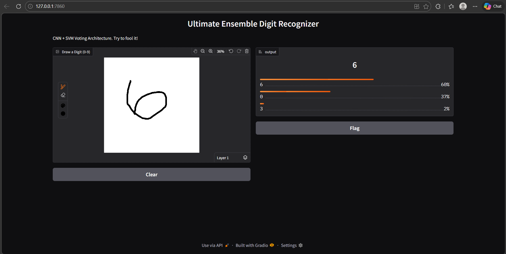

# 🧠 Elite Digit Recognition System: CNN & SGD Ensemble


A production-grade, real-time handwritten digit recognition application. This project goes beyond standard MNIST tutorials by implementing an **Ensemble Learning Architecture** and robust **OpenCV pre-processing** to handle real-world user input dynamically.



## ✨ Key Features (The "Wow" Factors)

* **Ensemble Voting Architecture:** Combines the spatial pattern recognition of a Convolutional Neural Network (CNN) with the geometric boundary logic of a Stochastic Gradient Descent (SGD) Classifier. The models "vote" to provide a highly confident final prediction.
* **Auto-Centering & Bounding Boxes:** Uses OpenCV (`cv2.findNonZero`, `cv2.boundingRect`) to dynamically locate the user's ink, crop empty space, and mathematically center the digit before inference. This allows users to draw anywhere on the canvas at any scale.
* **Dynamic Pre-processing:** Automatically handles Domain Shift (light/dark mode backgrounds) by checking pixel brightness and auto-inverting colors, followed by digital dilation to match the thick stroke weights of the MNIST dataset.
* **Real-Time Interactive UI:** Built with Gradio, featuring live inference. The AI predicts and updates its confidence bars dynamically as the user is actively drawing.

---

## 🏗️ System Architecture

1. **Input:** User draws on a 200x200 web canvas.
2. **Pre-processing Engine:** * Grayscale conversion & Auto-Invert.
   * OpenCV contour detection for Auto-Centering to a 20x20 bounding box with 4px padding.
   * Dilation (stroke thickening) and Normalization (0.0 - 1.0 scaling).
3. **Inference Engine:**
   * **Model A:** TensorFlow CNN (Conv2D -> MaxPooling -> Dropout -> Dense).
   * **Model B:** Scikit-Learn Fast SGD Classifier (trained on 60,000 flattened images).
4. **Output:** Weighted probability blend (60% CNN / 40% SGD) displayed via a live confidence meter.

---

## 📂 Project Structure

```text
Digit_Recognition_Pro/
│
├── models/             # Compiled weights (digit_brain.h5, digit_svm.pkl)
├── src/                
│   ├── train.py        # Generates the models using the MNIST dataset
│   └── app.py          # The Gradio Web Application & Inference Engine
├── requirements.txt    # Python dependencies
└── README.md
🚀 How to Run Locally
1. Setup the Environment
Clone the repository and create a virtual environment:

Bash
python -m venv venv
# Windows: venv\Scripts\activate
# Mac/Linux: source venv/bin/activate
Install the required dependencies:

Bash
pip install -r requirements.txt
(Note: Create a requirements.txt with: tensorflow, numpy, opencv-python, gradio, scikit-learn, joblib)

2. Train the "Brains" (Phase 1)
Build the CNN and SGD models from scratch. This script downloads the MNIST dataset, trains both models, and saves them to the /models directory.

Bash
python src/train.py
3. Launch the Web Interface (Phase 2)
Start the Gradio server to interact with the trained ensemble model.

Bash
python src/app.py
Click the local URL (typically http://127.0.0.1:7860) provided in the terminal to open the drawing pad.

🧠 Future Improvements
Implement data augmentation (rotation, zooming) during CNN training to further reduce overfitting.

Expand the dataset to include the EMNIST dataset for full alphanumeric character recognition.